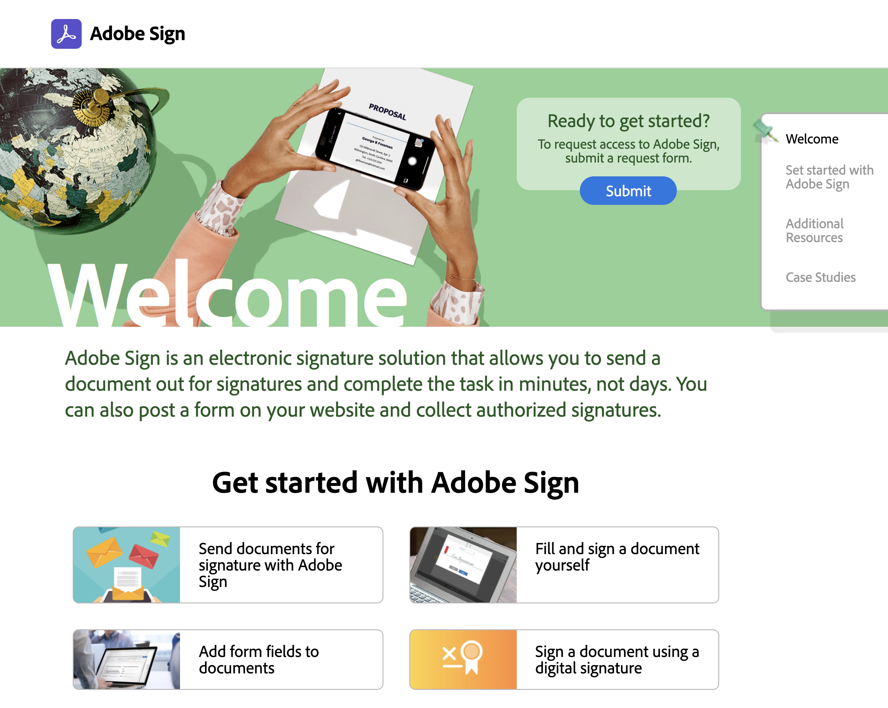
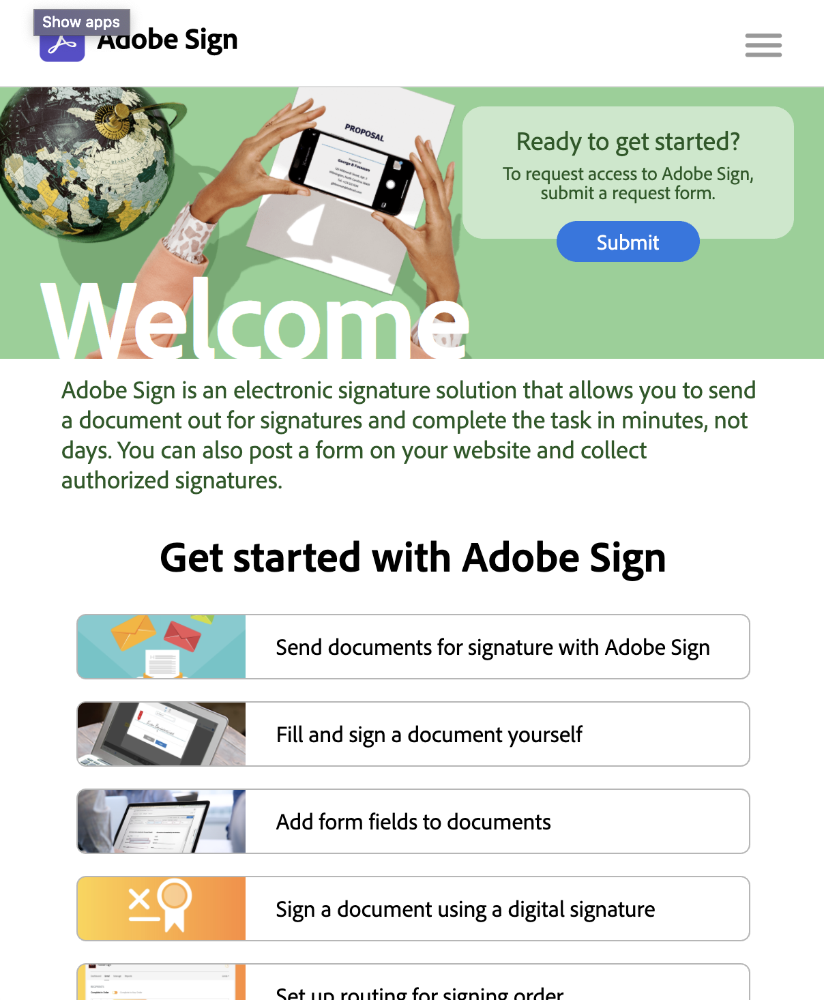

# Adobe Sign Resource Hub

This repository contains templates for project documentation, ensuring necessary
legal and contributor documentation is explicit. All sections below in this `README.md`
should be considered a template for a typical project `README.md`.

## SIGN RESOURCE HUB

Turnkey Adobe Sign Resource Hub

<!--  -->

## Goals

It's critical to enable an organization's users to fully leverage tools available.  This is a turnkey resource hub that is designed to be hosted on client systems.

### Installation

This codebase is currently dependent on Prepros & should work out of the box.  It's also supposed to work with CodeKit, but I have not tested that yet.

If you are going to modify this site, do so in the `source` dir.

To deploy, there is a flat HTML site in the `publish` dir.

### Contributing

Contributions are welcomed! Read the [Contributing Guide](./.github/CONTRIBUTING.md) for more information.

### Licensing

This project is licensed under the Apache V2 License. See [LICENSE](LICENSE) for more information.
